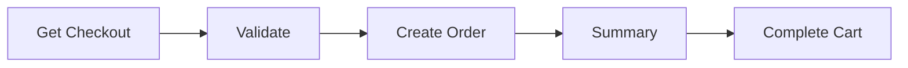

# Checkout Process

## Overview

The checkout process is a easy straightforward process that involves 4 steps. The following chart illustrates the checkout process:



::: info :nerd_face: Take note
Some of the steps are optional if you use an external payment gateway some of the steps are done by Geins Backend.
:::

## Get Checkout

The only thing needed to get a checkout, is a `cartId`. This means that you need to have a cart created before you can start the checkout process.

To get started read [Get Checkout](/packages/oms/checkout/get.md)

::: tip :bulb: Tip
You can also use get checkout to get the options available for the checkout process.
:::

## Validate The Checkout

This validates the checkout with stock values and checks if client is blacklisted or not.

## Place Order

Placing the order will create an order in the system to be processed.

## Get Summary

This will return a summary of the checkout process.

::: info :nerd_face: Take note
Some external payment gateways expect you to render their summary.
:::

## Complete cart and remove it from users session or client

As a last step you can complete the cart to remove it from the system. This is optional but recommended to keep the system clean. Read more about [Complete Cart](/packages/oms/cart/#complete) and [Remove Cart](/packages/oms/cart/#remove)

## Example

```typescript
// load cart if not already loaded
await geinsOMS.cart.get(cartId);
// set cart as complete
await geinsOMS.cart.complete();
// remove cart from session
await geinsOMS.cart.remove();
```
