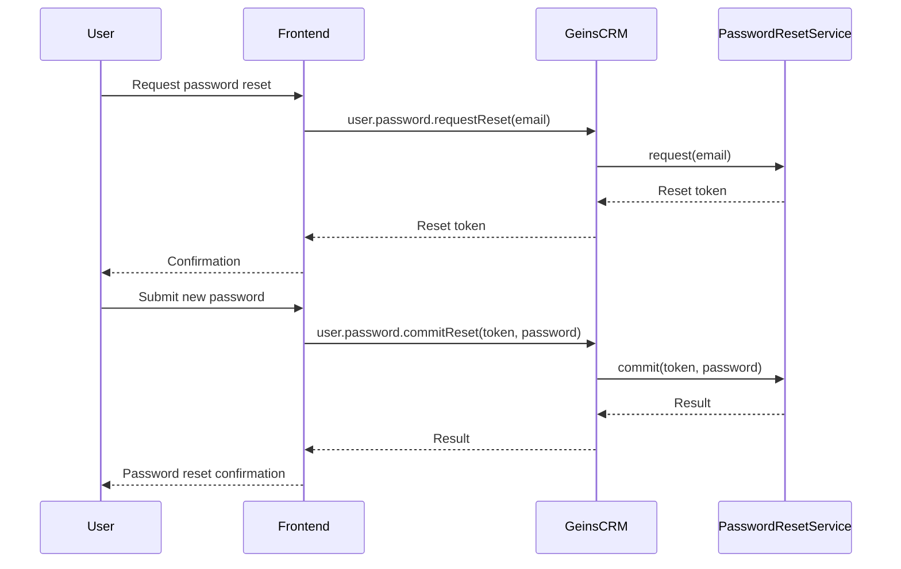

# Authentication

This document outlines how to authenticate users using the GeinsCRM class.

## Auth service

The GeinsCRM class provides methods for user authentication, including login, logout, token refresh, and user retrieval.

### Initializing GeinsCRM

First, you need to initialize the GeinsCRM class:

```typescript
import { GeinsCore } from '@geins/core';
import { GeinsCRM } from '@geins/crm';
import { AuthSettings, AuthClientConnectionModes } from '@geins/types';

const geinsCore = new GeinsCore({
  apiKey: 'your-api-key',
  accountName: 'your-account-name',
  environment: 'production', // or 'QA'
});

const authSettings: AuthSettings = {
  clientConnectionMode: AuthClientConnectionModes.Direct, // or AuthClientConnectionModes.Proxy
};

const geinsCRM = new GeinsCRM(geinsCore, authSettings);
```

### User Login

To log in a user:

```typescript
const credentials = {
  username: 'user@example.com',
  password: 'password123',
  rememberUser: true, // Set to true for extended session
};

const loginResult = await geinsCRM.auth.login(credentials);

if (loginResult?.succeeded) {
  console.log('Login successful');
  // Handle successful login (e.g., redirect to dashboard)
} else {
  console.error('Login failed');
  // Handle login failure
}
```

### User Logout

To log out a user:

```typescript
await geinsCRM.auth.logout();
console.log('User logged out');
```

### Token Refresh

To refresh the authentication token:

```typescript
const refreshResult = await geinsCRM.auth.refresh();

if (refreshResult?.succeeded) {
  console.log('Token refreshed successfully');
} else {
  console.error('Token refresh failed');
  // Handle refresh failure (e.g., redirect to login page)
}
```

### Get Current User

To retrieve the current auth user:

```typescript
const userResult = await geinsCRM.auth.get();

if (userResult?.succeeded) {
  console.log('User:', userResult.user);
} else {
  console.error('Failed to retrieve user');
}
```

### Change Password

To change a user's password:

```typescript
const changePasswordResult = await geinsCRM.user.password.change({
  username: 'user@example.com',
  password: 'newPassword123',
});

if (changePasswordResult?.succeeded) {
  console.log('Password changed successfully');
} else {
  console.error('Failed to change password');
}
```

### Register New User

To register a new user:

```typescript
const newUserCredentials = {
  username: 'newuser@example.com',
  password: 'password123',
};

const userInfo = {
  newsletter: false,
  customerType: GeinsCustomerType.PersonType,
};

const registerResult = await geinsCRM.user.create(newUserCredentials, userInfo);

if (registerResult?.succeeded) {
  console.log('User registered successfully');
} else {
  console.error('Failed to register user');
}
```

### Check Authorization

To check if the current user is authorized:

```typescript
const isAuthorized = await geinsCRM.auth.authorized();

if (isAuthorized) {
  console.log('User is authorized');
} else {
  console.log('User is not authorized');
}
```

## Password reset

To to initiate a password reset, call the user.password.requestReset method with the user's email address. This will send an email to the user with a reset key.

```typescript
const resetResult = await geinsCRM.auth.user.password.requestReset('user@example.com');
```

After the user has initiated the password reset, they need to submit a new password. This is done by calling the user.password.commitReset method with the reset key and the new password.

```typescript
const resetResult = await geinsCRM.auth.user.password.commitReset('reset-key', 'newPassword123');
```



## Refresh token

The GeinsCRM class automatically manages authentication tokens using cookies. After successful login or token refresh, the necessary cookies are set. You don't need to manually handle token storage in most cases.

## User token

The user token is used to authenticate the user and is stored in the user's browser cookies. It is used to authenticate the user when the user is logged in through the and in all calls to the Merchant API.

## Example

Here's an example of error handling in authentication:

```typescript
try {
  const loginResult = await geinsCRM.auth.login(credentials);
  // Handle result
} catch (error) {
  console.error('Authentication error:', error);
  // Handle error (e.g., show error message to user)
}
```

Remember to handle authentication failures gracefully in your application, such as redirecting to a login page or showing appropriate error messages to the user.

## Spoofing
