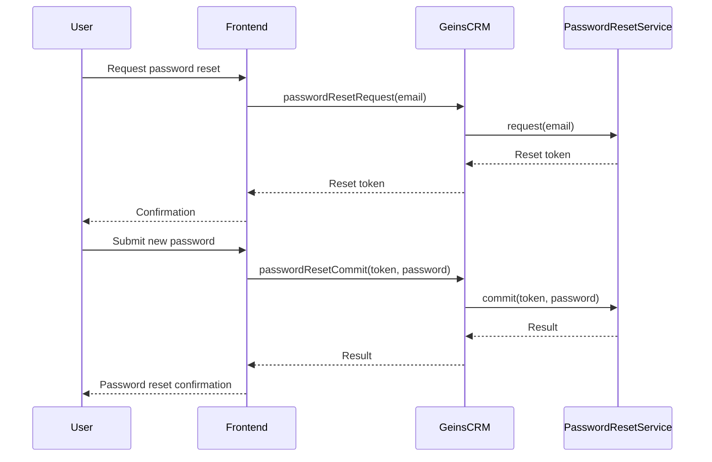

# Authenticate

## Auth service

## Password reset

```mermaid
sequenceDiagram
    participant User
    participant Frontend
    participant GeinsCRM
    participant PasswordResetService
    User->>Frontend: Request password reset
    Frontend->>GeinsCRM: passwordResetRequest(email)
    GeinsCRM->>PasswordResetService: request(email)
    PasswordResetService-->>GeinsCRM: Reset token
    GeinsCRM-->>Frontend: Reset token
    Frontend-->>User: Confirmation
    User->>Frontend: Submit new password
    Frontend->>GeinsCRM: passwordResetCommit(token, password)
    GeinsCRM->>PasswordResetService: commit(token, password)
    PasswordResetService-->>GeinsCRM: Result
    GeinsCRM-->>Frontend: Result
    Frontend-->>User: Password reset confirmation

```

## RefreshToken

## JWT token

## Example

## Spoofing
