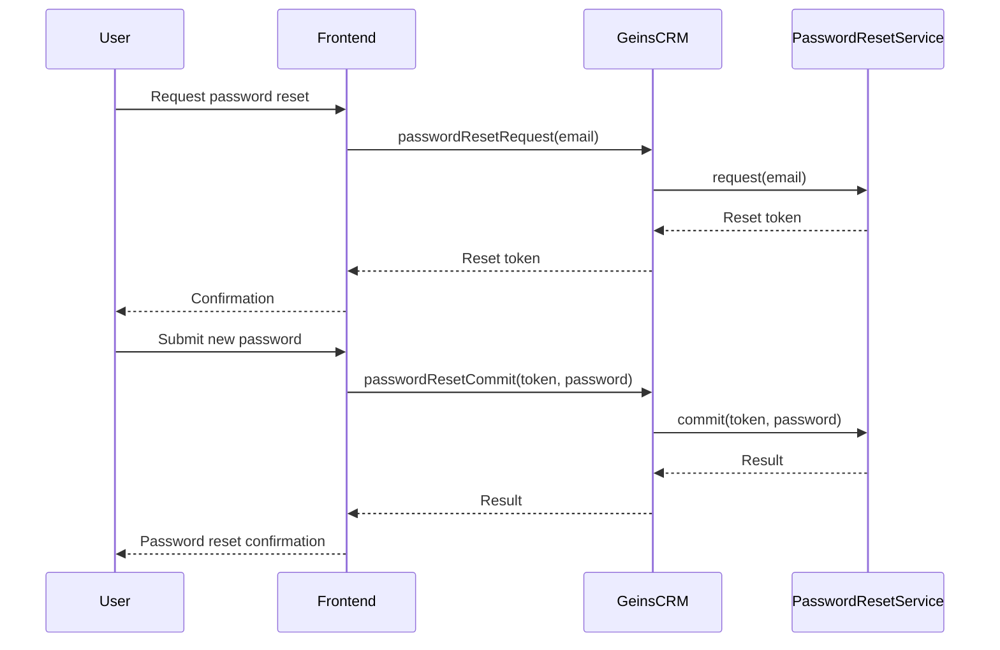

# Password Management

## Password Reset

## Password Policy

## Password Encryption

## Password Commitment

### Change Password

To change a user's password:

```typescript
const changePasswordResult = await geinsCRM.auth.changePassword({
  username: 'user@example.com',
  password: 'newPassword123',
});

if (changePasswordResult?.succeeded) {
  console.log('Password changed successfully');
} else {
  console.error('Failed to change password');
}
```

## Password reset

To to initiate a password reset, call the passwordResetRequest method with the user's email address. This will send an email to the user with a reset key.

```typescript
const resetResult = await geinsCRM.auth.passwordResetRequest('user@example.com');
```

After the user has initiated the password reset, they need to submit a new password. This is done by calling the passwordResetCommit method with the reset key and the new password.

```typescript
const resetResult = await geinsCRM.auth.passwordResetCommit('reset-key', 'newPassword123');
```


