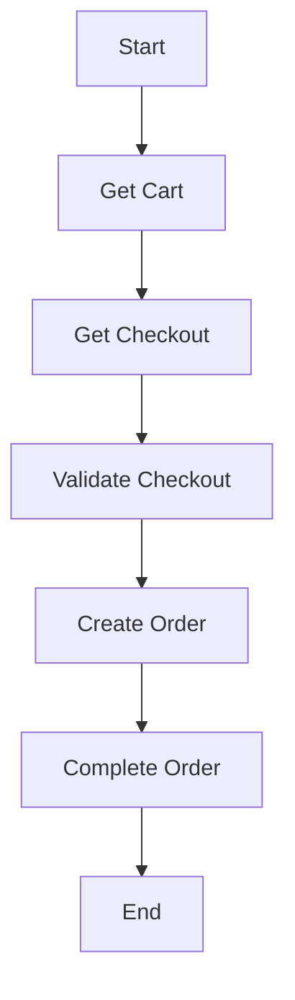

# Checkout Process

## Overview

## Process chart for best practices

The checkout process is a multi-step process that involves several steps. The following chart illustrates the checkout process:

## Payment Methods

## Shipping Methods

## Redirect 

## External Checkouts 

## Internal Checkouts

## Validate Checkout

## Get Summary

